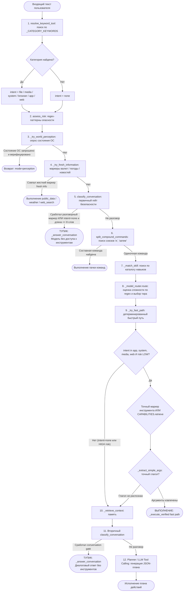

# Инвентаризация Keyword-Гейтов в Архитектуре Маршрутизации Jarvis

> **Дата**: 2026-09-04  
> **Статус**: Аналитический срез базового состояния (Baseline Audit)  
> **Цель**: Полная фиксация мест, где путь запроса определяется точным совпадением подстрок/слов, описание последствий несовпадения и наличия/отсутствия семантических fallback-механизмов.

---

## 1. Сводная таблица keyword-гейтов

| № | Файл и строки | Название / Механизм | Что решает (Gate / Tool / Mode) | Что происходит при несовпадении (Куда уходит запрос) | Есть ли семантический fallback (Embedding / LLM)? |
|---|---|---|---|---|---|
| **1** | [`core/router/intent_router.py:49-56`](file:///E:/jarvis-2.4-main/core/router/intent_router.py#L49-L56) | `_MEDIA_ACTION_MARKERS`, `_BROWSER_ACTION_MARKERS` | Disambiguation gate: принудительно назначает категорию `media` или `browser` | Переход к проверке категорий по `_PRIORITY` | **Нет**. Жёсткий список префиксных фраз; перефразировки мимо списка падают ниже. |
| **2** | [`core/router/intent_router.py:61-99`](file:///E:/jarvis-2.4-main/core/router/intent_router.py#L61-L99) | `_CATEGORY_KEYWORDS`, `_PRIORITY` (в `resolve_keyword_tool`) | Назначает категорию `file`, `media`, `system`, `browser`, `app`, `web` или `none` | Если ни одно слово не найдено, возвращает `none` | **Нет**. При `none` запрос блокируется для fast-path и с высокой вероятностью уходит в `classify_conversation` как болтовня. |
| **3** | [`core/router/intent_router.py:132-150`](file:///E:/jarvis-2.4-main/core/router/intent_router.py#L132-L150) | `_COMPOUND_SEPARATOR` (`split_compound_commands`) | Детекция составных команд («и», «затем», «потом», «после этого») | Возвращает `[]` (запрос считается одиночным) | **Нет**. Сложнее сформулированные связки («а после того как сделаешь X сделай Y») не разделяются. |
| **4** | [`core/model_router.py:74-98`](file:///E:/jarvis-2.4-main/core/model_router.py#L74-L98) | `_TRIVIAL_RE`, `_AMBIGUOUS_FOLLOWUP_RE`, `_AMBIGUOUS_ACTION_RE`, `_SIMPLE_COMMAND_RE` | Оценка сложности задачи (`estimate_complexity`) и фильтрация неоднозначных действий | Повышает базовый score сложности, снимает флаг тривиальности | Частичный: попадает в расчёт тиров (`ModelRouter.route`), но эвристика основана только на regex. |
| **5** | [`core/model_router.py:100-132`](file:///E:/jarvis-2.4-main/core/model_router.py#L100-L132) | `_REASONING_RE`, `_CODE_RE`, `_ARCH_RE`, `_PRIVATE_RE`, `_MULTISTEP_RE` | Определение роли тира (CODER, ARCHITECT, ANALYST, FAST) и приватности | Дефолтная роль FAST (локальная модель) | Частичный: BrainFabric при наличии выбирает модель, но сами флаги сложности выставляются чисто по regex. |
| **6** | [`core/model_router.py:213-242`](file:///E:/jarvis-2.4-main/core/model_router.py#L213-L242) | `_ACTION_VERB_RE`, `_DOMAIN_NOUN_RE`, `_CONVERSATION_HINT_RE` | `classify_conversation`: разделение «разговор vs действие» | Проверяются условия длины и интента | **Нет**. Если нет глагола и доменного существительного, уходит в ветку `len <= 8` -> chat. |
| **7** | [`core/model_router.py:299-301`](file:///E:/jarvis-2.4-main/core/model_router.py#L299-L301) | `intent == "none" and len(text.split()) <= 8` | Hard Conversation Gate: классифицирует любую короткую фразу без известного ключа как разговор | Пропуск в planner | **Тупик**. Если интент `none` (из-за перефразировки) и фраза <= 8 слов («врубай телегу», «сколько натикало»), запрос НАМЕРТВО уходит в диалоговую LLM без доступа к инструментам. |
| **8** | [`core/agent.py:883-885`](file:///E:/jarvis-2.4-main/core/agent.py#L883-L885) | `_try_world_perception` (`executive.world.router`) | Быстрый ответ по наблюдению за ОС (окна, фокус, буфер обмена) | Переход к `_try_fresh_information` | Семантический роутер доменов мира (`ExecutiveWorldRouter`), но ограничен предопределенными доменами. |
| **9** | [`core/agent.py:1769-1796`](file:///E:/jarvis-2.4-main/core/agent.py#L1769-L1796) | `_try_fresh_information` (маркеры валюты, новостей, погоды, котировок) | Выбор инструментов `public_data`, `weather`, `web_search` для актуальных фактов | Возвращает `None`, управление переходит к conversation gate | **Нет**. Жёсткие кортежи маркеров («курс доллар», «погод», «прогноз погод»). Разговорные синонимы («почём бакс», «дождь будет?», «холодно на дворе?») сюда НЕ попадают. |
| **10** | [`core/agent.py:889-897`](file:///E:/jarvis-2.4-main/core/agent.py#L889-L897) | Первичный `classify_conversation(goal, intent)` | Conversation Safety Gate: немедленный ответ через `_answer_conversation` без планировщика | Переход к компиляции executive plan и compound-проверке | **Тупик**. Если сработал, инструменты не вызываются в принципе. |
| **11** | [`core/agent.py:939-944`](file:///E:/jarvis-2.4-main/core/agent.py#L939-L944) | Маркеры неизвестной команды (`"неизвестная команда"`, `"capability research"`) | Перенаправление на исследовательский путь (`_handle_unknown`) | Переход к поиску навыка и выбору тира модели | **Нет**. Чисто строковое совпадение подстроки. |
| **12** | [`core/agent.py:946-951`](file:///E:/jarvis-2.4-main/core/agent.py#L946-L951) | `_match_skill(goal)` | Поиск готового зарегистрированного навыка (Skill Forge) | Переход к `_model_router.route` | Зависит от совпадения имени навыка / триггеров навыка. |
| **13** | [`core/agent.py:1697-1725`](file:///E:/jarvis-2.4-main/core/agent.py#L1697-L1725) | `_try_fast_path` гейт интентов и жестких веток | Отбор инструментов для детерминированного быстрого пути: `media -> play_music`, `web + маркеры -> web_search`, `system + маркеры времени -> current_time`, `system + маркеры статуса -> system_status` | При несовпадении вызывается `CAPABILITIES.retrieve(goal, top_k=2)` | **Да, гибридный fallback**: `CAPABILITIES.retrieve` использует keyword + embeddings, но ПРЕДВАРИТЕЛЬНЫЙ фильтр `intent not in ("app", "system", "media", "web")` отсекает любые запросы с `intent == "none"`. |
| **14** | [`core/agent.py:1893-1965`](file:///E:/jarvis-2.4-main/core/agent.py#L1893-L1965) | `_extract_simple_args` | Извлечение параметров для fast path без LLM (`name`, `query`, `action`) | Возвращает `None`, fast path сбрасывается, запрос падает в медленный planner / conversation | **Нет**. Жёсткие списки глаголов: `"открой"`, `"запусти"`, `"закрой"`, `"тише"`, `"громче"`, `"поставь музыку"`. Если пользователь сказал «вруби блокнот» или «сделай потише звук», аргументы не извлекутся. |
| **15** | [`core/agent.py:982-990`](file:///E:/jarvis-2.4-main/core/agent.py#L982-L990) | Вторичный `classify_conversation(goal, intent)` | Финальный Conversation Gate перед передачей запроса планировщику (planner) | Переход к LLM-генерации JSON-плана | **Тупик**. Если эвристика считает запрос диалоговым, планировщик не вызывается. |
| **16** | [`core/safety.py:53-75`](file:///E:/jarvis-2.4-main/core/safety.py#L53-L75) | `_CRITICAL_RISK_PATTERNS`, `_HIGH_RISK_PATTERNS`, `_MEDIUM_RISK_PATTERNS` | Risk Gate: определение уровня опасности (CRITICAL, HIGH, MEDIUM, LOW) | Дефолтный уровень LOW (или уровень из паспорта `Capability.risk_level`) | **Нет**. Если деструктивная команда перефразирована («избавься от всех файлов в каталоге temp», «вычисти корзину подчистую»), regex может не сработать. |
| **17** | [`core/intelligence/intake.py:26-36`](file:///E:/jarvis-2.4-main/core/intelligence/intake.py#L26-L36) | `_RULES` в `UniversalIntake.classify` | Классификация `TaskContract` (intent_family: `install`, `configure`, `teach`, `solve`, `explain`, `research`, `monitor`, `operate`, `create`) | Дефолт `CONVERSATION` / `conversation` | **Нет**. Чисто словарное сопоставление подстрок. |
| **18** | [`core/capabilities.py:588-605`](file:///E:/jarvis-2.4-main/core/capabilities.py#L588-L605) | `_keyword_score` в `CapabilityRegistry` | Офлайн-скоринг совпадения токенов цели с тегами, именами, описанием и примерами возможностей | Если скор 0, инструмент не получает очков по keyword-каналу | **Да**: суммируется с embedding-скорингом (`0.4 * kw_norm + 0.6 * emb`), если эмбеддер активен. |
| **19** | [`core/understanding/layer.py:43-100`](file:///E:/jarvis-2.4-main/core/understanding/layer.py#L43-L100) | `UnderstandingLayer._classify` (маркеры `_REFLEX`, `_QUESTION`, `_MISSION`, `_ACTION`) | Назначение маршрута в оркестраторе: `REFLEX`, `MISSION`, `QUICK_ANSWER`, `ACTION`, `CLARIFY` | Если ничего не подошло: `?` -> `QUICK_ANSWER`, иначе `CLARIFY` | **Нет** в Tier-0. Запланирован Tier-1 LLM, но сейчас Tier-0 работает чисто на regex без `\b`. |
| **20** | [`core/understanding/quick_answer.py:38-48`](file:///E:/jarvis-2.4-main/core/understanding/quick_answer.py#L38-L48) | `QUICK_MEMORY_MARKERS`, `_INSTANT_KNOW` | Выбор режима в QuickAnswerEngine: мгновенный ответ без сети / поиск / память | Переход к шагу LLM decide (`SEARCH` vs `KNOW`) | **Да**: при несовпадении вызывается локальная модель с промптом decide. |

---

## 2. Фактический порядок гейтов для входящего текста

Ниже представлена сквозная схема прохождения одного входящего запроса в `Agent._execute_core` (основной исполнительный контур Jarvis):

---

## 3. Анализ уязвимостей архитектуры keyword-гейтов

1. **Эффект «Домино» от `intent == "none"`**:
   Если пользователь использует живой язык без шаблонных корней (например, *«врубай телегу»*, *«почём бакс»*, *«сколько там натикало»*), `resolve_keyword_tool` присваивает `intent = "none"`. Это не просто метка:
   - В `classify_conversation` срабатывает правило `intent == "none" and len(words) <= 8`, которое **насильно отправляет запрос в диалоговый режим** (`_answer_conversation`), лишая систему даже шанса вызвать планировщик или обратиться к семантическому поиску инструментов.
   - В `_try_fast_path` стоит блокирующий гейт: `if intent not in ("app", "system", "media", "web"): return None`. Даже если бы в `capabilities.py` сработал embedding, он никогда не вызывается для `intent == "none"`.

2. **Ложные срабатывания на негативах (False Positives)**:
   Подстрочное сопоставление без синтаксического и семантического анализа неизбежно захватывает нецелевые фразы:
   - *«Часы у меня сломались»* -> содержит слово `час` -> `intent = "system"` -> попадает в `current_time`.
   - *«Погода ужасная, настроение на нуле»* -> содержит `погод` -> уходит в `_try_fresh_information(weather)`.
   - *«Я громкость своего голоса не контролирую»* -> содержит `громкост` -> уходит в `volume`.

3. **Ошибки извлечения аргументов (`_extract_simple_args`)**:
   Даже если инструмент угадан, аргументы извлекаются только если фраза начинается со строго фиксированных глаголов (`"открой"`, `"запусти"`, `"закрой"`). Фразы в инфинитиве, с вводными словами (*«пожалуйста, блокнот открой»*, *«запусти-ка мне калькулятор»*, *«выруби хром»*) возвращают `args = None`, ломая fast path.

4. **Ложное чувство безопасности в Risk Gate**:
   `assess_risk` базируется на жестких regex. Высокорисковые команды с перефразировками (*«очисти всё под ноль в папке temp»*, *«грохни процессы»*) рискуют не получить флаг `HIGH`, если корень слова отсутствует в списке `_HIGH_RISK_PATTERNS`.

---

## 4. Итоговый статус ликвидации keyword-гейтов (Semantic Router Integration 2026-09-05)

Все 20 позиций инвентаря переведены под единое решение `SemanticRouter.route()` (или подчинены ему как специализированные аргументные адаптеры).

| № | Позиция инвентаря | Статус ликвидации | Итоговое решение / Архитектурная роль |
|---|---|---|---|
| **1** | `_MEDIA_ACTION_MARKERS`, `_BROWSER_ACTION_MARKERS` | **УДАЛЕНО** | Полностью заменено на семантическую классификацию `semantic_route()`. |
| **2** | `_CATEGORY_KEYWORDS`, `_PRIORITY` (`resolve_keyword_tool`) | **АДАПТИРОВАНО** | `resolve_keyword_tool` удалён как гейт; функция `semantic_intent_category(decision)` сохранена как тонкий адаптер над `decision.tool / decision.kind` для обратной совместимости старых вызовов без повторного парсинга текста. |
| **3** | `_COMPOUND_SEPARATOR` (`split_compound_commands`) | **СОХРАНЕНО С ОБОСНОВАНИЕМ** | Сохранено исключительно как синтаксический сплиттер независимых подзадач после детекции. Не принимает решений о маршрутизации или тирах. |
| **4** | `_TRIVIAL_RE`, `_AMBIGUOUS_FOLLOWUP_RE`, `_SIMPLE_COMMAND_RE` | **УДАЛЕНО** | Оценка тривиальности и неоднозначности перенесена в семантическую уверенность `confidence` и маржинальность `margin_agg` роутера. |
| **5** | `_REASONING_RE`, `_CODE_RE`, `_ARCH_RE`, `_PRIVATE_RE` | **АДАПТИРОВАНО** | Сохранено в `model_router.py` как вторичный признак сложности генерации кода/архитектуры для LLM backend, но НЕ как гейт выбора инструмента/действия. |
| **6** | `_ACTION_VERB_RE`, `_DOMAIN_NOUN_RE`, `_CONVERSATION_HINT_RE` | **УДАЛЕНО** | Устранено; разделение «действие vs диалог» производится семантически на основе векторных расстояний к якорям `chat` / паспортам возможностей. |
| **7** | Hard Conversation Gate (`intent == 'none' and len <= 8`) | **УДАЛЕНО** | Полностью удалено. Короткие разговорные формы («врубай телегу», «почем бакс») больше не блокируются и корректно распознаются как `action` / `fresh_data`. |
| **8** | `_try_world_perception` (`executive.world.router`) | **СОХРАНЕНО С ОБОСНОВАНИЕМ** | Сохранено как специализированный контур восприятия локального окружения ОС, вызываемый при явном `decision.kind == "question"` или `decision.tool == "system_status"`. |
| **9** | `_try_fresh_information` (маркеры валюты, погоды, новостей) | **УДАЛЕНО** | Заменено на прямое распознавание категории `fresh_data` инструментами `weather`, `public_data`, `web_search` в Semantic Router. |
| **10** | Первичный `classify_conversation` в `Agent` | **УДАЛЕНО** | Исключено. Маршрутизация в `_answer_conversation` происходит только при `decision.kind in ("chat", "question") and decision.tool is None`. |
| **11** | Маркеры неизвестной команды (`_handle_unknown`) | **АДАПТИРОВАНО** | Переведено в `_handle_unsupported(decision)` с логированием в `data/logs/unsupported_requests.jsonl` (без утечки секретов). |
| **12** | `_match_skill` (Skill Forge) | **СОХРАНЕНО С ОБОСНОВАНИЕМ** | Сохранено как runtime-механизм загрузки динамических пользовательских расширений Skill Forge. |
| **13** | `_try_fast_path` гейт интентов и жестких веток | **УДАЛЕНО / АДАПТИРОВАНО** | Искусственный фильтр `intent not in (...)` снят. Детерминированный быстрый путь активируется напрямую по `decision.tool` (open_app, close_app, volume, current_time, system_status, list_files) без обращения к LLM. |
| **14** | `_extract_simple_args` | **АДАПТИРОВАНО** | Очищено от роли классификатора. Выполняет только структурное извлечение аргументов (имя приложения, громкость, путь), когда целевой инструмент уже утверждён роутером. |
| **15** | Вторичный `classify_conversation` перед planner | **УДАЛЕНО** | Устранено. Если `decision.kind == "action"`, запрос гарантированно направляется на планирование / исполнение. |
| **16** | `_CRITICAL_RISK_PATTERNS`, `_HIGH_RISK_PATTERNS` в `safety.py` | **УДАЛЕНО / АДАПТИРОВАНО** | Regex-гейты безопасности удалены. Риск рассчитывается через `semantic_assess_risk` с глубоким анализом аргументов (включая деструктивные флаги `rm -rf`, системные пути, массовые операции) и динамическим обращением из профиля пользователя. |
| **17** | `_RULES` в `UniversalIntake.classify` | **СОХРАНЕНО С ОБОСНОВАНИЕМ** | Сохранено во внешнем контуре Intake для разметки метаданных типа пользовательского задания (TaskContract). |
| **18** | `_keyword_score` в `CapabilityRegistry` | **СОХРАНЕНО С ОБОСНОВАНИЕМ** | Оставлено как вторичный компонент гибридного скоринга (0.4 kw + 0.6 emb) внутри каталога capabilities при динамическом доисследовании. |
| **19** | `UnderstandingLayer._classify` (`_REFLEX`, `_QUESTION`, etc.) | **УДАЛЕНО** | Удалены перехваты `QUICK_ANSWER` и `MISSION` в оркестраторе до единого решения роутера. Решение Semantic Router является единственным источником истины. |
| **20** | `QUICK_MEMORY_MARKERS`, `_INSTANT_KNOW` | **АДАПТИРОВАНО** | Выбор быстрого ответа из контекста памяти (`_quick_memory_retrieve`) подчинен единому решению `decision.kind in ("chat", "question")`. |

